# SDL2-Mandelbrot-Plotter

<div align="center">

[![Download][download-shield]][download-url]
[![SDL][sdl-shield]][sdl-url]
[![Latest][latest-shield]][latest-url]
[![License][license-shield]][license-url]

My version of a Mandelbrot set plotter using SDL2 Library 


</div>

<details open>
    <summary>Table Of Content</summary>
    <ol>
        <li><a href="#overview">Overview</a></li>
        <li>
        <a href="#getting-started">Getting Started</a>
        <ul>
            <li><a href="#ui-element">UI Element</a></li>
            <li><a href="#extra">Extra</a></li>
        </ul>
        </li>
        <li>
            <a href="#usage">Usage</a>
            <ul>
                <li><a href="#control">Control</a></li>
                <li><a href="#terminal">Terminal</a></li>
            </ul>
        </li>
        <li><a href="#license">License</a></li>
    </ol>
</details>
<br>
<br>
<br>

# Overview
The Mandelbrot set is a set of complex number on the complex plane that will not deviate when it is iterated multiple time with the formula  Z<sub>n+1</sub> = Z<sub>n</sub><sup>2</sup> + C

This program plot the mandelbrot set by mapping out each pixel according to the coordinate of the complex plane and then iterate it multiple time with the formula mentioned above until it exceed a certain value. Each pixel is then colored according to the number of iteration it reaches, unless it reaches the maximum iteration allowed in this case the pixel is then colored black.

Increasing the maximum iteration count will reveal more detail of the mandelbrot set, and with this program you can explore the world of the mandelbrot set made just from a simple mathematical equation.

<p align="right"><a href="#sdl2-mandelbrot-plotter">[Back to Top]</a></p>

<br>
<br>
<br>

# Getting Started
Download the latest version from [release](https://github.com/Arif-Rachmat/SDL2-Mandelbrot-Plotter/releases). Extract the binaries and dll to a single directory, or extract the whole folder.

<br>

>## UI element
When you open the program you will see the mandelbrot set being rendered in the viewport as well as other UI element/info showing in the top left corner. Those UI/info will help you to navigate when exploring the mandelbrot set.

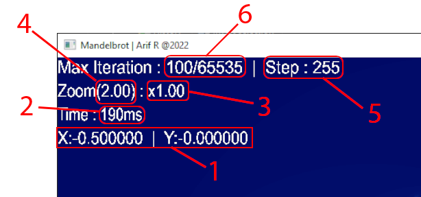

### 1. Center Coordinate
This coordinate is where the center of the screen is curently located. This will help you to navigate around when exploring the mandelbrot set.

<br>

### 2. Frame Time
Total time needed to render the current frame.

<br>

### 3. Zoom value
It's the zoom!.

<br>

### 4. Zooming multiplier
When zooming in/out this value will multiply the current zoom value.

<br>

### 5. Iteration step
When increasing/decreasing the maximum iteration value, this value will add or subtract the current max iteration value.

<br>

### 6. Maximum Iteration
This value limit the maximum iteration count of a value in the set before it hit it's potential iteration count. Thus increasing this value may reveal more detail at a cost of more calculation cycle needed.

<br>
<br>

>## Extra
- ### Locked zoom coordinate
This is the coordinate where the camera will zoom in/out when using the manual/keyboard zoom or the [AutoZoom](#autozoom) feature. This variable will change whenever you zoom in/out with you mouse/cursor. You can set the initial coordinate when starting the program to zoom to a certain coordinate you targeted accurately using the [Terminal Command](#zoom-coordinate).

<br>

- ### AutoZoom
This feature when enabled will automatically zoom to the [Locked Coordinate](#locked-zoom-coordinate) using the current [Zooming multiplier](#4-zooming-multiplier) value. There's currently a frame capture feature being develop so you can automatically capture each frame and then stitch them together to make something like [this](image/mandelbrot.gif).

<p align="right"><a href="#sdl2-mandelbrot-plotter">[Back to Top]</a></p>


<br>
<br>
<br>

# Usage
This section will show you how to use the program and multiple way of using it to explore the mandelbrot set.
<br>
<br>

>## Control

|                  Key                  |           Function                   |
|:-------------------------------------:|:------------------------------------:|
|`Left click`                           | Zoom in to the cursor location       |
|`Right click`                          | Zoom out from the cursor location    |
|<kbd>E</kbd>                           | Zoom in to the [locked coordinate](#locked-zoom-coordinate) |
|<kbd>Q</kbd>                           | Zoom out from the [locked coordinate](#locked-zoom-coordinate)|
|<kbd>U</kbd>                           | Toggle info UI                       |
|<kbd>Z</kbd>                           | Toggle AutoZoom                      |
|`Mousewheel Up`                        | Increase Max iteration               |
|`Mousewheel Down`                      | Reduce Max iteration                 |
|<kbd>LCtrl</kbd> + `Mousewheel Up`     | Increase iteration stepping value    |
|<kbd>LCtrl</kbd> + `Mousewheel Down`   | Reduce iteration stepping value      |
|<kbd>LShift</kbd> + `Mousewheel Up`    | Increase Zooming multiplier value    |
|<kbd>LShift</kbd> + `Mousewheel Down`  | Reduce Zooming multiplier value      |

<br>
<br>
<br>

>## Terminal
Openning the program directly by clicking it will run the program with the default configuration, while running the program from the terminal will provide more option and configuration.
```powershell
mandelbrot.exe [argument]
```
****All argument can be passes together in any order.***

<br>
<br>

#### Some of the available arguments are :

<br>

- ### Resolution
This argument will set the window resolution. Setting this to a high value will slows down the rendering time. The default value is `800 x 800`.
```powershell
mandelbrot.exe -r [width] [height]
```
example of setting the resolution to 1920 x 1080 :
```powershell
mandelbrot.exe -r 1920 1080
```
<br>

- ### Zoom Coordinate
This argument will set the starting [zoom coordinate](). Example of the zooming coordinate can be found in [here](http://www.cuug.ab.ca/dewara/mandelbrot/images.html). The default starting coordinate is `X = 0.281717921930775` & `Y = 0.5771052841488505`.
```powershell
mandelbrot.exe -c [X Coordinate] [Y Coordinate]
```
example of setting the starting zoom coordinate to `X = 0.840719` &
`Y = 0.22442` :
```Powershell
mandelbrot.exe -c 0.840719 0.22442
```
<br>

- ### Colortheme
This Argument change the colortheme to any of the currently 4 different colortheme. The default color is `palette 0` commonly found in the [Wikipedia](https://en.wikipedia.org/wiki/Mandelbrot_set).
```powershell
mandelbrot.exe -p [palette index]
```
example of setting the colortheme to `palette 2` :
```powershell
mandelbrot.exe -p 1
```
Example of the colortheme and it's palette index can be found in the [gallery](#gallery)

<p align="right"><a href="#sdl2-mandelbrot-plotter">[Back to Top]</a></p>

<br>
<br>
<br>

# Gallery
- ### Colortheme/palette 1 `-p 0`
<p float="left">
    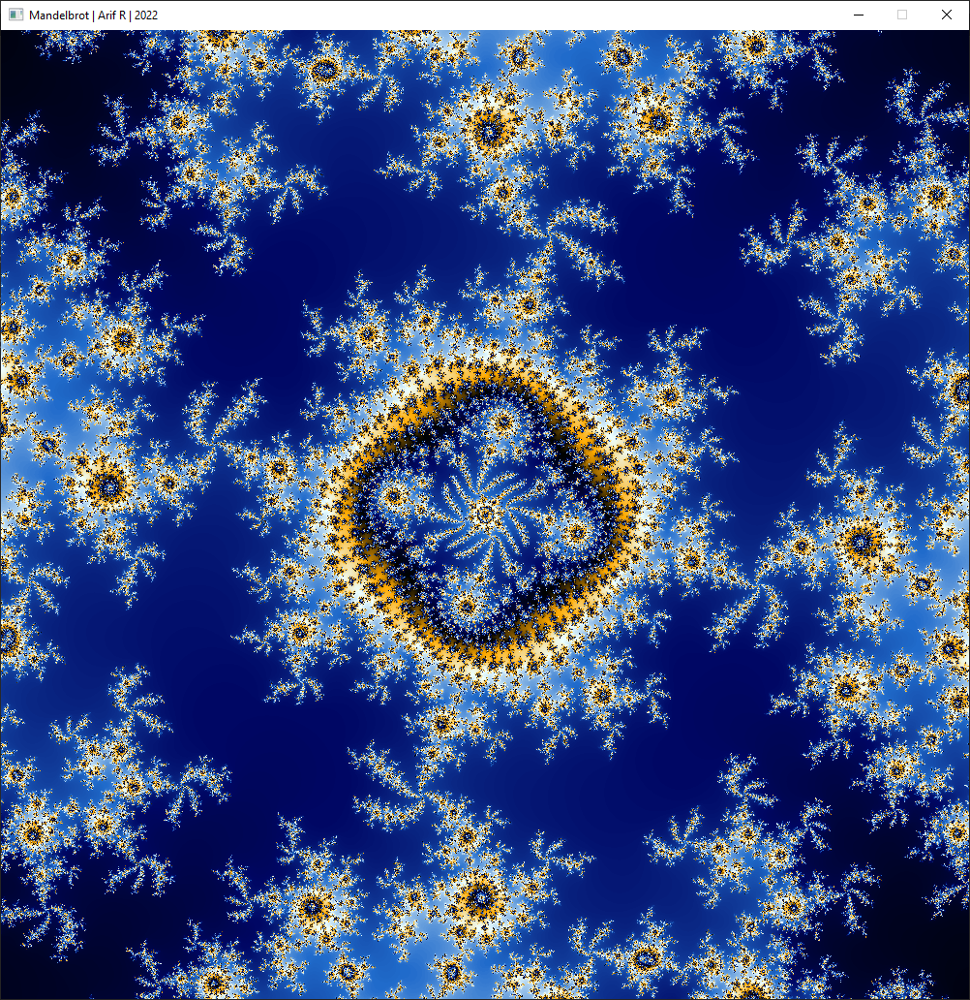
    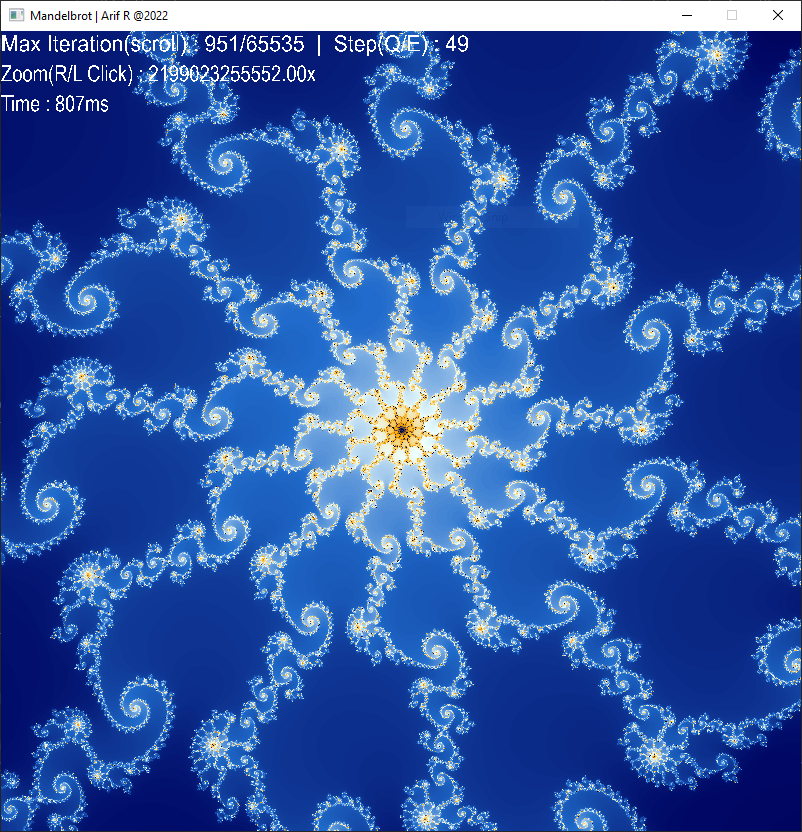
    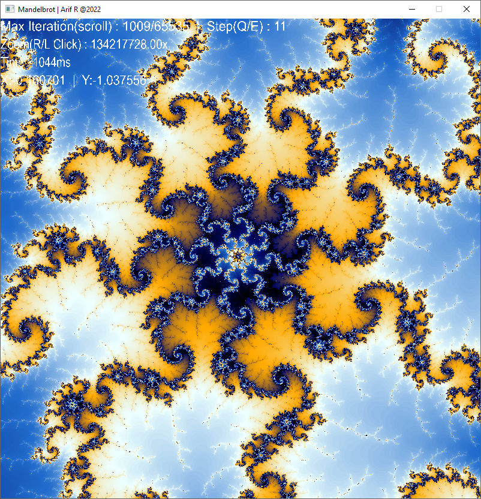
    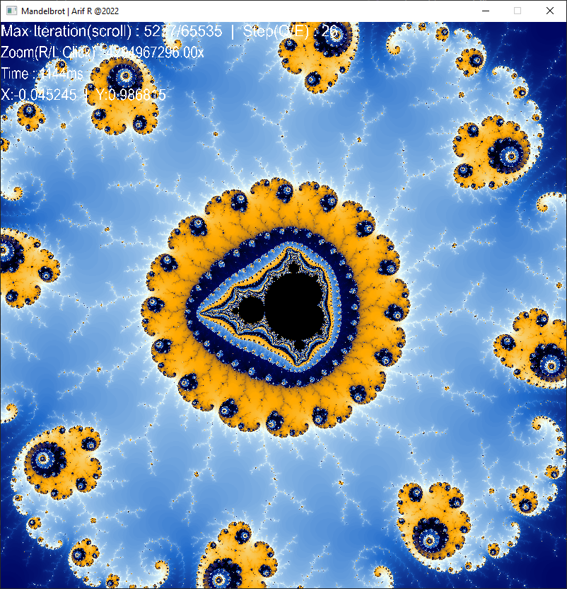
    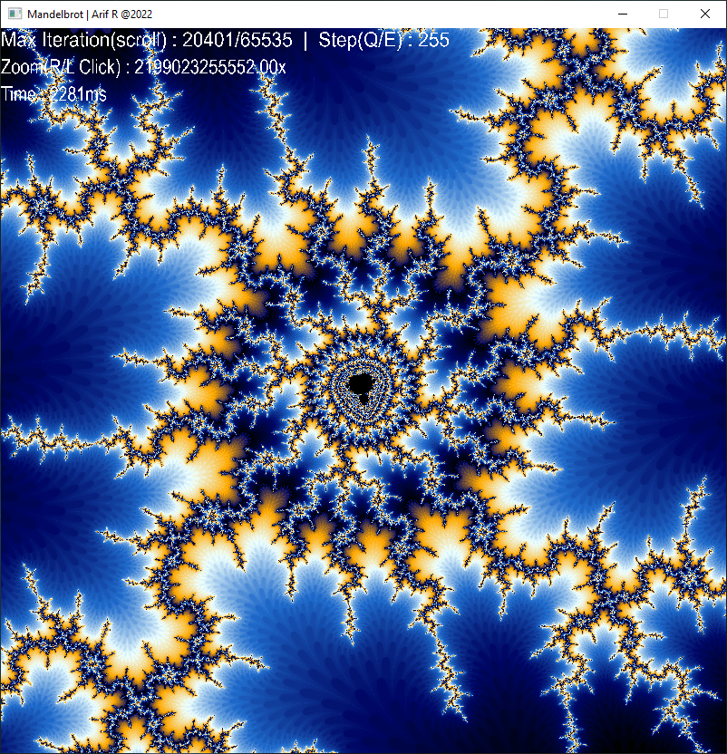
    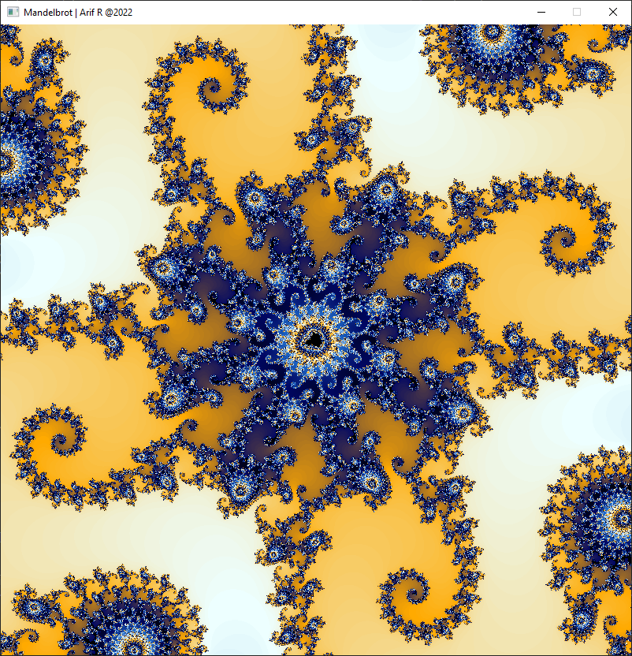
</p>

<br>

- ### Colortheme/palette 2 `-p 1`
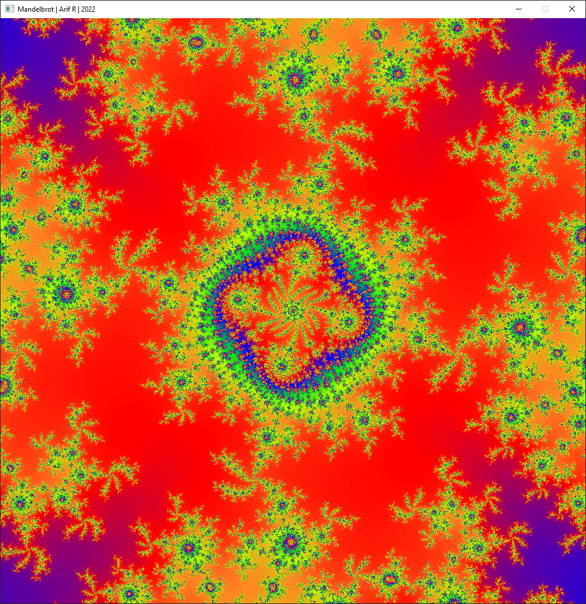

<br>

- ### Colortheme/palette 3 `-p 2`
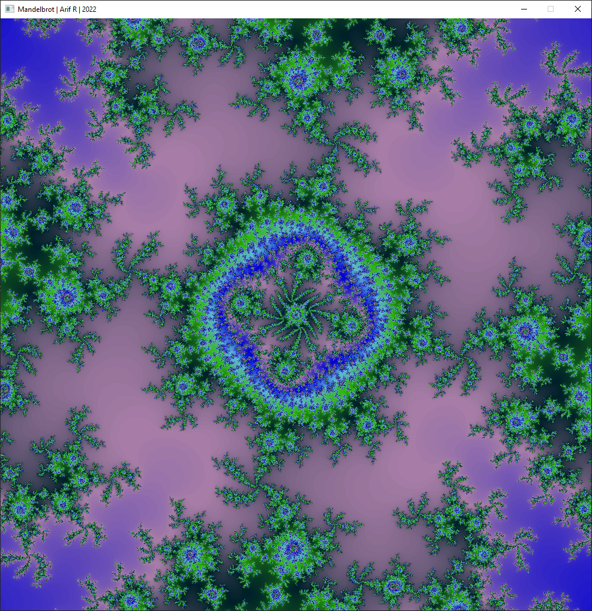

<br>

- ### Colortheme/palette 4 `-p 3`
<p float="left">
    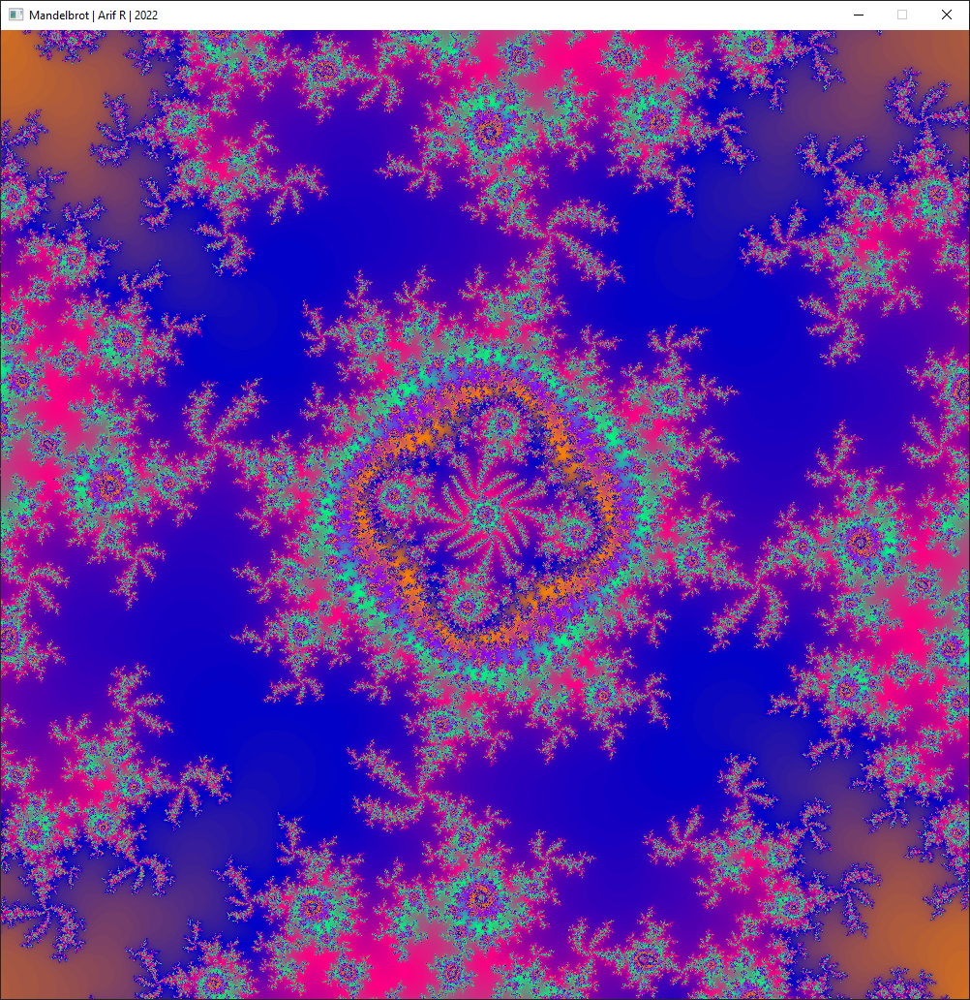
    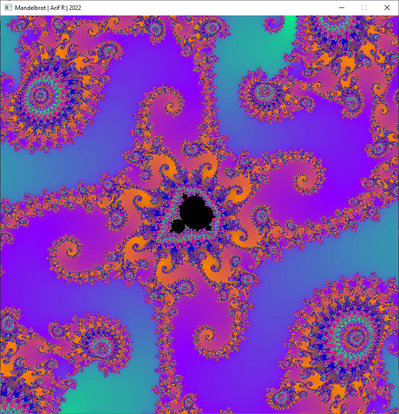
    
    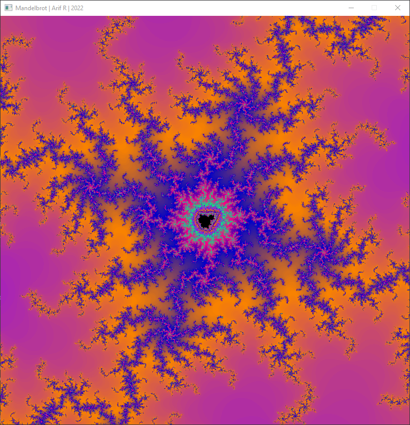
    
    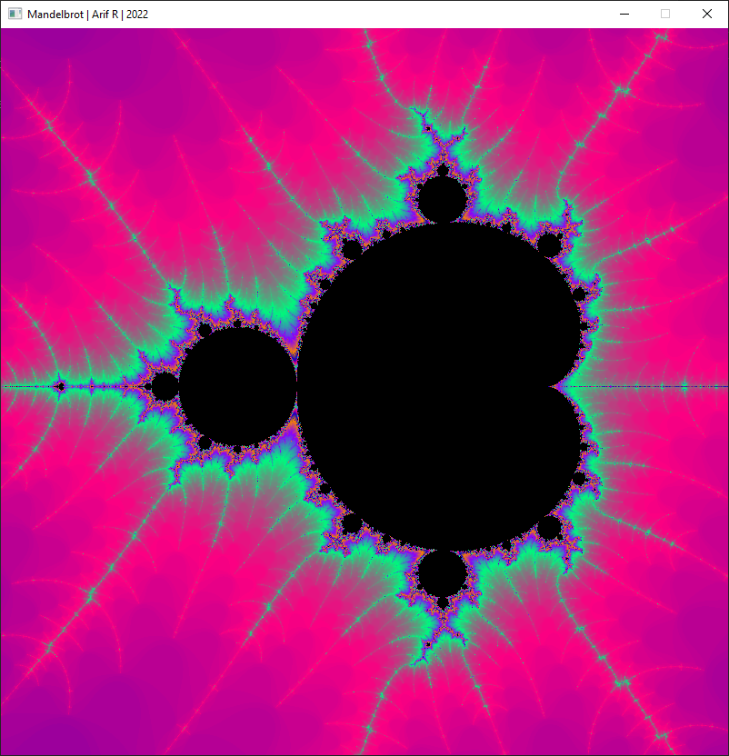
</p>
<p align="right"><a href="#sdl2-mandelbrot-plotter">[Back to Top]</a></p>

<br>
<br>
<br>

# License
Distributed under the GNU General Public V3.0 License. See [`License`](LICENSE) for more information.

<p align="right"><a href="#sdl2-mandelbrot-plotter">[Back to Top]</a></p>


<!-- Link for badge and others -->
[download-shield]: https://img.shields.io/github/downloads/Arif-rachmat/SDL2-Mandelbrot-Plotter/total?color=green&label=Download&logo=GitHubhttps://img.shields.io/badge/Download-v1.0.0-brigthgreen
[download-url]: https://github.com/Arif-Rachmat/SDL2-Mandelbrot-Plotter/releases
[sdl-shield]:  https://img.shields.io/badge/SDL-v2.0.20-brigthgreen
[sdl-url]: https://www.libsdl.org/
[latest-shield]: https://img.shields.io/github/v/release/Arif-rachmat/SDL2-Mandelbrot-Plotter?label=Latest
[latest-url]: https://github.com/Arif-Rachmat/SDL2-Mandelbrot-Plotter/releases/tag/v0.1.0
[license-shield]: https://img.shields.io/github/license/Arif-rachmat/SDL2-Mandelbrot-Plotter?logo=GitHub
[license-url]: LICENSE